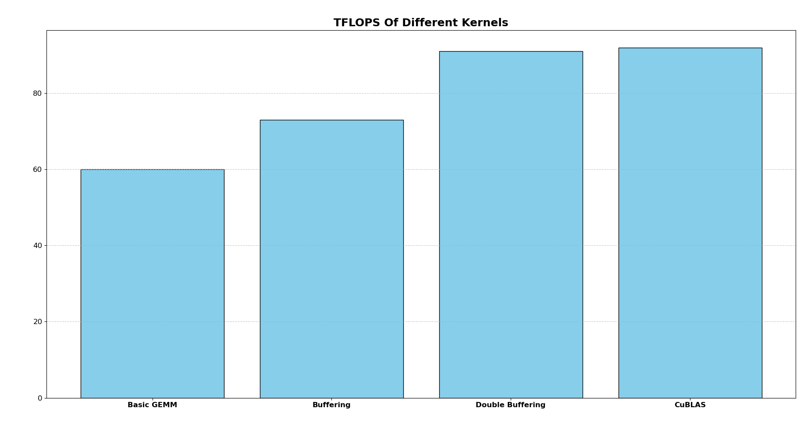

# Cuda Tensor Core Multiplication at the Speed of CuBLAS in Three Simple Steps


The repo describes how to reach 95% of the speed of CuBLAS for matrix multiplication with half-floats in three simple steps. The TFlops of the three different kernels and the reference CuBLAS code are shown below:



The kernels have been obtained by reverse-engineering the SASS code of the CuBLAS code. The process is described [here](https://fabianschuetze.github.io/gemmcuda.html) in greater detail.

## How to Compile and Run the Code
The code gets compiled simply with `nvcc src/matrix -Iinclude -lcublas -arch=sm_86`. Running the three kernels and the reference kernel can be done by calling `./a.out -1`, which produces:
```
root@c1cdc7e26eb8:/workspace/matrix# ./a.out -1
runs with all ids

 Kernel: CublasRefernece
Average elapsed time: (1.462106) ms, performance: (94000.7) GFLOPS. size: (4096).

 Kernel: BasicGEMM
Average elapsed time: (2.308537) ms, performance: (59535.1) GFLOPS. size: (4096).

 Kernel: Buffering
Average elapsed time: (1.891883) ms, performance: (72646.6) GFLOPS. size: (4096).

 Kernel: DoubleBuffering
Average elapsed time: (1.500277) ms, performance: (91609.0) GFLOPS. size: (4096).

```
 The code targets the Ampere architecture. The Hopper architecture introduced new instructions (most notably produce and consumer warps).

## References
There are several excellent repos from which I learned a lot. Most notably:

- https://github.com/siboehm/SGEMM_CUDA
- https://github.com/Bruce-Lee-LY/cuda_hgemm
- https://github.com/NVIDIA/cuda-samples
- https://github.com/NVIDIA/cutlass
